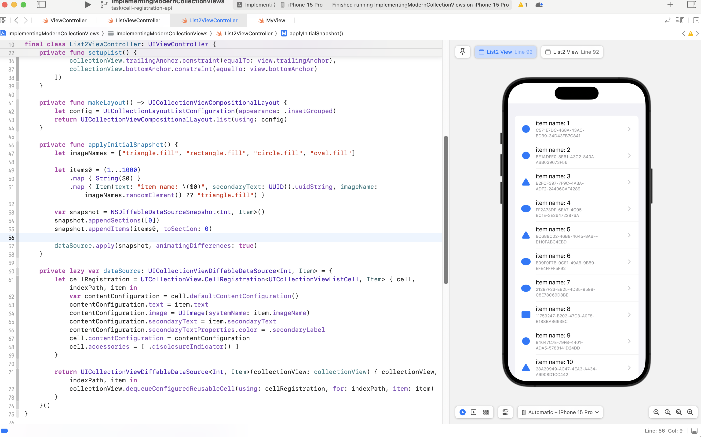

# iOS-Swift-ImplementingModernCollectionViews
[Implementing Modern Collection Views](https://developer.apple.com/documentation/uikit/views_and_controls/collection_views/implementing_modern_collection_views)

## Tech Stack
- Modern Collection Views API
  - UICollectionViewCompositionalLayout
  - NSDiffableDataSourceSnapshot<Section, Item>
  - UICollectionView.CellRegistration<UICollectionViewListCell, Item>

## Architecture Diagram
 

## Preview

